<p align="center">
  
</p>

<h1 align="center">⚡ ElimuMS — Smart School Management System</h1>

<p align="center">
  <strong>Kenya's most complete CBC-aligned school management platform.</strong><br/>
  One platform. Every school need. Built for Kenyan schools. Powered by AI.
</p>

<p align="center">
  
  
  
  
  
  
  
  
  
</p>

---

## 📋 Table of Contents

- [What is ElimuMS?](#-what-is-elimums)
- [CBC Grade Structure](#-cbc-grade-structure)
- [Supported School Levels](#-supported-school-levels)
- [Demo Environment](#-demo-environment)
- [Feature Modules](#-feature-modules)
- [Timetable & Scheduling](#-timetable--scheduling-module)
- [System Settings](#️-system-settings-module)
- [Multi-Tenancy & Platform Architecture](#-multi-tenancy--platform-architecture)
- [Financial Ledger & Integrity](#-financial-ledger--integrity)
- [Academic Year Rollover](#-academic-year-rollover)
- [Access Control & Data Scoping](#-access-control--data-scoping)
- [Audit & Activity Logging](#-audit--activity-logging)
- [Data Protection & Compliance](#-data-protection--compliance)
- [Operational Readiness](#️-operational-readiness)
- [Roles & Access Control](#-roles--access-control)
- [Database Schema & Entity Relationships](#️-database-schema--entity-relationships)
- [Tech Stack](#️-tech-stack)
- [API Integrations](#-api-integrations)
- [Quick Start](#-quick-start)
- [Default Login Accounts](#-default-login-accounts)
- [Module Structure](#-module-structure)
- [Testing](#-testing)
- [Roadmap](#️-roadmap)
- [Contributing](#-contributing)
- [License](#-license)
- [Acknowledgements](#-acknowledgements)

---

## 🎯 What is ElimuMS?

**ElimuMS** is a fully open-source, self-hosted, enterprise-grade school management system built from the ground up for Kenyan schools implementing the **Competency-Based Curriculum (CBC)**. It unifies every aspect of school operations — academics, finance, transport, communication, AI assistance, compliance, and parent engagement — into one powerful, production-ready platform.

> **Own your data. Deploy on your server. Pay once. Run forever.**

ElimuMS is not a SaaS subscription. It is yours — fully open-source, self-hosted, and infinitely customisable for your school's unique needs.

---

## 📚 CBC Grade Structure

```
Pre-Primary → Lower Primary → Upper Primary → Junior Secondary → Senior Secondary
  PP1–PP2        Gr 1–3          Gr 4–6           Gr 7–9             Gr 10–12
```

| Level | Grades | Assessment Style |
|---|---|---|
| Pre-Primary | PP1 – PP2 | Observational / Portfolio |
| Lower Primary | Grade 1 – 3 | EE / ME / AE / BE Rubrics |
| Upper Primary | Grade 4 – 6 | EE / ME / AE / BE + KPSEA (Gr 6) |
| Junior Secondary | Grade 7 – 9 | Numeric marks + Rubrics |
| Senior Secondary | Grade 10 – 12 | Pathways-based + KCSE (Gr 12) |

### Assessment Rubric

| Code | Descriptor | Meaning |
|---|---|---|
| **EE** | Exceeds Expectation | Learner surpasses expected competency |
| **ME** | Meets Expectation | Learner fully demonstrates competency |
| **AE** | Approaches Expectation | Learner is progressing toward competency |
| **BE** | Below Expectation | Learner needs additional support |

---

## 🏫 Supported School Levels

| Level | Grades | Status |
|---|---|:---:|
| Pre-Primary | PP1 – PP2 | ✅ Fully Supported |
| Lower Primary | Grade 1 – 3 | ✅ Fully Supported |
| Upper Primary | Grade 4 – 6 | ✅ Fully Supported |
| Junior Secondary | Grade 7 – 9 | ✅ Fully Supported |
| Senior Secondary | Grade 10 – 12 | ✅ Fully Supported |
| Multi-campus / County Rollout | — | 🔧 Roadmap |

---

## 👥 Demo Environment

The system ships with a complete, realistic demo dataset:

| User Type | Count | Details |
|---|:---:|---|
| 👩‍🏫 Teachers | 10 | Assigned to learning areas & classes |
| 👨‍👩‍👧 Parents / Guardians | 20 | Linked to learners (including sibling pairs) |
| 🧒 Learners | 40 | Spread across PP1 → Grade 9 |
| 🏫 HODs | 2 | English & Mathematics departments |
| 🎓 Class Teachers | 5 | One per stream |

> Run `php artisan migrate --seed` to load demo data. See **INSTALL.md** for full configuration.

---

## 🚀 Feature Modules

### 🏛️ 1. School Management — Core

- Learner registration & enrollment (PP1 → Grade 12)
- KEMIS UPI number assignment, sync & validation
- Class and stream assignment per term and academic year
- Transfer-in / transfer-out with full audit trail
- Boarding vs day scholar tracking with different fee structures
- Special educational needs (SEN) recording per learner
- Sibling linking for family-level fee discounts
- House / team assignment with points tracking
- Disciplinary records and follow-up tracking
- Alumni registry and graduation tracking

---

### 📋 2. CBC Assessment Engine

- Full **EE / ME / AE / BE** rubric entry per strand and sub-strand
- 40% formative + 60% summative weighting — automatically calculated
- Bulk assessment import via Excel — entire class in minutes
- Competency portfolio per learner — growth tracked from PP1 to Grade 12
- Grade 7–12 numeric marks alongside rubric levels
- Missed assessment alerts — flags incomplete records
- HOD approval workflow for submitted assessments
- Term-level competency locking for audit integrity
- Historical competency trend per learner

---

### 📊 3. Analytics, Insights & Reporting

- Live school performance dashboard with real-time charts
- Per-class, per-stream, per-teacher comparison analytics
- **Strand heatmaps** — identify exactly which sub-strands learners struggle with most
- **At-risk learner detection** — rolling averages flag learners before they fall behind
- **Early alert system** — auto-notifies class teacher when a learner drops below threshold
- **Cohort tracking** — follow a class from enrollment all the way to Grade 12
- Term-on-term competency trend graphs
- Rubric distribution charts (EE/ME/AE/BE breakdown per class and school-wide)
- Teacher performance metrics — assessment completion rates, average rubric levels awarded
- HOD department analytics — compare teachers within a learning area
- Fee collection analytics and projections
- Attendance heatmaps and absenteeism reports
- Teacher load and room utilisation reports
- Principal, HOD & BOG summary reports (PDF)
- KEMIS-ready data export (CSV/JSON)
- Ministry of Education compliance report generation

---

### 📄 4. CBC Report Cards

- Auto-generated PDF report cards in full EE/ME/AE/BE format per strand
- Competency descriptors auto-populated per learning area
- AI-assisted teacher & principal remarks
- Attendance summary embedded in every report card
- Cumulative multi-term report generation
- **Digital delivery to parents via SMS link** — no printing required
- Bulk generation — produce an entire class's reports in one click
- Customisable school branding (logo, colours, motto)
- Printable A4 format reports

---

### 🤖 5. AI Tools — Powered by Anthropic Claude

| AI Tool | What It Does |
|---|---|
| 🧠 **AI Lesson Assistant** | Generates complete lesson plans from strand, sub-strand & SLOs in seconds |
| ✅ **AI Marking Assistant** | Teacher submits learner response; AI suggests rubric level with justification |
| 📝 **AI Question Generator** | Upload notes or topic; get a ready CAT/exam with MCQ, short-answer & essay |
| 📈 **AI Performance Insights** | Reviews full competency history, flags root causes of underperformance |
| 💬 **AI Report Comments** | Auto-suggests teacher remarks appropriate to each rubric level |
| 🗓️ **AI Timetable Optimizer** *(roadmap)* | Learns preferences & room availability; auto-generates conflict-free schedules |

---

### 📚 6. Curriculum & Lesson Planner

- Learning areas mapped per grade level
- Strands, sub-strands, and specific learning outcomes (SLOs)
- Lesson plan creation with HOD/principal approval workflow
- Scheme of work management per term
- CBC learning resource and notes upload (PDF, video, documents)
- Resources organised by grade, learning area, and strand

---

### 📖 7. Smart Homework System

- Teacher assigns homework per class and learning area with strand tagging
- Learners submit from phone or PC via the submission portal
- Deadline countdown display for learners and parents
- Auto-reminders via SMS + push — 24 hours and 1 hour before deadline
- Teacher marks submissions with rubric-aligned grading and written feedback
- **Parent visibility dashboard** — real-time homework status per child
- Homework analytics — class completion rates, average scores per assignment
- Late submission tracking with configurable grace periods

---

### ✅ 8. Attendance Management

- Per-lesson or once-daily marking mode, configurable per school
- Learner statuses: Present, Absent, Late, Excused, On Leave
- Staff clock-in/out via biometric, QR, or manual entry
- Late-arrival cut-off with escalation after N late marks
- **Auto-SMS to parent** when learner is marked absent
- Daily, weekly and termly attendance summaries plus heatmaps
- Chronic absenteeism alerts — flags learners missing above a threshold
- Attendance feeds directly into report cards — auto-populated on generation
- Lost contact hours report (feeds into Timetable module)

---

### 📖 9. Library Management

- Book catalog with title, author, ISBN, category, copies (Dewey or custom classification)
- Author and publisher master lists
- Borrowing and renewal workflow with per-category limits
- Overdue fines and damage/loss charge calculation
- Barcode/QR scanning for issue and return at the circulation desk
- Reservation queue for high-demand titles

---

### 🚌 10. Transport & Bus Tracking

- Route management with stop mapping (latitude/longitude)
- Real-time bus location via GPS device integration
- Parent live tracking from the parent portal
- Driver alerts — route deviation, late arrival notifications
- Driver records — license details, contact, assigned vehicle
- Monthly transport fee auto-billing per route
- Vehicle register with insurance and inspection expiry alerts
- Incident reporting for drivers

---

### 🛏️ 11. Hostel / Boarding Management

- Dormitory register — name, capacity, gender designation
- Bed numbering and occupancy tracking
- House parent assignment per dormitory
- Boarding fees linked to Fees & Finance module
- Auto or manual bed allocation, re-run term to term

---

### 🩺 12. Discipline & Welfare

- Incident logging with category, severity, and involved parties
- Disciplinary action tracking — warning, suspension, parent meeting — with sign-off workflow
- Sick-bay / health records — visits, symptoms, medication given, parent notified
- Chronic condition and allergy flags surfaced to class teachers and matron
- Confidential by default — visible only to configured roles

---

### 🏠 13. Parent Engagement Portal

- Child academic dashboard — live rubric levels, attendance & upcoming homework
- Home learning resource library — curated by teachers per grade and learning area
- Parent-teacher messaging (threaded per child)
- School communication hub — notices, circulars, events & calendar
- Fee statement view and M-Pesa payment directly from portal
- Parent meeting scheduling with RSVP tracking
- Transport live tracking access
- Submit and track data subject access/deletion requests

---

### 💰 14. Fees & Finance Management

- Flexible fee structures per grade, term, boarding/day status, with sibling discounts
- **M-Pesa STK Push** — parents receive a payment prompt directly on their phone (Safaricom Daraja API)
- **C2B Paybill integration** — real-time payment confirmation and auto-allocation
- Fee balance and arrears tracking per learner with aging report
- Bursary and scholarship management with funding source records (CDF, NG-CDF, county bursary)
- PDF receipts auto-sent to parent on every payment
- Bank payment receipting and manual entry
- Automated SMS fee reminders — 7 days, 3 days, and on due date (configurable)
- Finance analytics — daily/weekly/monthly collection reports
- Term revenue projections vs actual collection
- Expense tracking and income statement for bursar
- Outstanding arrears report for follow-up

> Ledger integrity, reconciliation and reversal rules specified in [Financial Ledger & Integrity](#-financial-ledger--integrity) below.

---

### 📦 15. Inventory & Store Management

- School assets register with condition and depreciation tracking
- CBC textbook inventory — issue and return per learner with signature record
- Lab equipment and stationery store
- Low-stock alerts — auto-notifies storekeeper
- Procurement module — raise LPOs, track deliveries, mark received
- Supplier register with contact management
- Disposal, loss, and damage recording

---

### 📝 16. Exams Management

- Create CATs, mid-terms, end-terms, mocks, KPSEA, KCSE papers
- Question bank — MCQ, short answer, structured essay — tagged by strand, sub-strand, Bloom's taxonomy
- Exam timetable with invigilation schedule and room assignment
- Mark entry with auto-calculation of grade, percentage, and rubric level
- KPSEA (Grade 6) and KCSE alignment templates
- Per-subject, per-class, and per-stream exam analytics
- Past paper archive by subject and year

---

### 📓 17. Learning Notes & Digital Library

- Teacher uploads notes — PDF, video, images, slides
- Organised by grade, learning area, strand, sub-strand
- Learner portal — searchable and filterable resource library
- Parent portal access for home learning support
- Offline-friendly downloadable packs (PWA — roadmap)
- Resource analytics — most-viewed notes, download counts

---

### 🔔 18. Notifications & Communication

- **SMS** via Africa's Talking API — per-school SMS wallet with balance alerts and rate limiting
- **Email** via Mailgun / SMTP
- **Push notifications** via Firebase Cloud Messaging
- **WhatsApp** *(roadmap)*
- Bulk SMS by grade, class, boarding status, or custom group
- Automated alerts: fees due, results ready, absenteeism, homework overdue, substitution cover
- Scheduled announcements — set a message to go out at a future time
- School-wide circular and notice board
- Parent-teacher direct messaging
- Delivery reports — track which messages were delivered

---

### 👩‍🏫 19. Staff & HR Management

- Teacher profiles with TSC number, qualifications, subjects assigned, and photo
- Leave management — annual, sick, maternity, paternity, compassionate
- Leave approval workflow: Teacher → HOD → Deputy Principal → Principal
- Staff daily attendance tracking
- Non-teaching staff management
- Payroll summary — basic, allowances, PAYE, NHIF, NSSF, NITA deduction calculations
- Professional development records — trainings attended, certifications earned
- Staff performance metrics — punctuality, assessment completion rates, lesson plan submissions

---

### 🌐 20. KEMIS Integration

- Learner UPI registration and bulk sync to KEMIS
- KEMIS learner UPI number lookup and linking
- School data export formatted for MOEST reporting
- Capitation eligibility data export
- KPSEA candidate registration support
- Pre-submission validation — catches missing UPIs and duplicates before export

---

## ⏰ Timetable & Scheduling Module

A school-wide timetabling engine covering **Pre-Primary through Senior Secondary** in one system. The same data renders three ways — **by Class, by Teacher, by Room** — so a class teacher, an HOD checking teacher load, and the deputy hunting for a free lab all read from one source of truth.

```
Day skeleton (configurable per level)

P1 ─ P2 ─ [Short Break] ─ P3 ─ P4 ─ [Tea Break] ─ P5 ─ P6 ─ [Lunch] ─ P7 ─ P8
08:00  08:40              09:40  10:20            11:20  12:00        13:00  13:40
```

### Core Concepts

| Concept | Description |
|---|---|
| **Period** | A named slot with start/end time and type: `lesson`, `break`, `assembly`, `games`, `prep` |
| **Day Template** | The ordered set of periods for a given level and weekday (Mon–Fri, optional Sat) |
| **Slot** | One cell: `class × day × period` holding a learning area, teacher and room |
| **Double Period** | Two adjacent slots merged for practicals, projects, CBC integrated learning |
| **Timetable Version** | A full snapshot — `draft`, `live` or `archived` — so a term's timetable can be rebuilt without breaking the published one |
| **Allocation** | How many periods per week a learning area must get, per grade |

### Timetable Views

**Class view** — weekly grid for one class with colour-coded cells showing learning area, teacher and room.

**Teacher view** — the same week from a teacher's perspective. Reveals gaps, back-to-back overload, and free periods for substitution.

**Room view** — occupancy for labs, halls, computer rooms and workshops. Prevents double-booking.

Controls on every view: Level selector, Class/Teacher/Room selector, Term switcher, Weekend toggle, Teacher legend colour-mapped per subject.

### Build / Generate

**Manual builder** — drag-and-drop with live clash detection; locked slots survive regeneration; bulk actions (clear day, copy Monday to Tuesday).

**Auto-generator** — constraint-based solver run as a queued job (`GenerateTimetable`), progress streamed to UI.

Hard constraints (never violated):
- A teacher cannot be in two places at once
- A class cannot have two lessons at once
- A room cannot host two classes at once
- Weekly period allocation must be met exactly
- Locked/pinned slots are immovable

Soft constraints (scored and optimised):
- Spread a learning area across the week rather than clustering
- Core subjects (Maths, English, Kiswahili) in morning periods
- Respect teacher max periods per day and per week
- Minimise teacher room-hopping between consecutive periods
- Avoid single-period gaps in a teacher's day
- Keep practicals adjacent so doubles are possible

Outputs a **draft version** with a quality score and list of unmet soft constraints for admin review before publishing live.

### Calendar & Events

- Full 12-month calendar with term dates overlaid
- **Kenyan public holidays** pre-seeded — New Year's Day, Good Friday, Easter Monday, Labour Day, Madaraka Day, Idd-ul-Fitr, Idd-ul-Azha, Huduma Day, Mashujaa Day, Jamhuri Day, Christmas, Boxing Day
- Term/break markers: opening day, mid-term break, closing day
- School events: sports day, prize giving, parents' day, KPSEA/KCSE windows, music festivals
- **Countdown chips** — scrolling strip showing "Mid-term break — 11 days · 28 Sept"
- Lessons falling on a holiday are flagged in reports so lost contact hours are visible

### Announcements

- Posted by role: Principal's Office, Deputy Principal, HOD, class teacher
- Audience targeting: all staff & parents, teaching staff only, a department, a grade, a stream, boarding parents
- Pinning — pinned notices surface on teacher dashboards
- Auto-expiry date; optional SMS/push fan-out via Notifications module

### Print & Export

- Print for any Class, Teacher or Room — Live or archived version
- **A4 landscape** with school logo, name, motto, class, room, year and term
- **QR code** on every printout linking to the live online version
- Teacher legend with subject specialisms; signature line for Head Teacher
- Bulk export: every class in a level as a single PDF
- CSV/JSON export for KEMIS and Ministry returns

### Substitutions & Cover

- Mark teacher absent → system lists affected lessons → proposes free, subject-qualified cover teachers
- Assign cover in one click; covering teacher gets SMS/push notification
- Daily **cover sheet** printed for the staffroom notice board
- Substitution history retained for workload and fairness reporting

### Timetable Analytics

- Teacher load report — periods per week, flagged against configured maximum
- Learning area coverage — allocated vs actual periods per grade
- Room utilisation percentage
- Lost contact hours from holidays, events and uncovered absences
- Clash audit log

### Timetable Access Control

| Action | Super Admin | Principal | Deputy | HOD | Class Teacher | Teacher | Parent | Learner |
|---|:---:|:---:|:---:|:---:|:---:|:---:|:---:|:---:|
| View timetables | ✅ | ✅ | ✅ | ✅ | ✅ | ✅ | 👁️ | 👁️ |
| Build / edit slots | ✅ | ✅ | ✅ | 👁️ | ❌ | ❌ | ❌ | ❌ |
| Run generator | ✅ | ✅ | ✅ | ❌ | ❌ | ❌ | ❌ | ❌ |
| Publish live version | ✅ | ✅ | ❌ | ❌ | ❌ | ❌ | ❌ | ❌ |
| Manage calendar events | ✅ | ✅ | ✅ | ❌ | ❌ | ❌ | ❌ | ❌ |
| Post announcements | ✅ | ✅ | ✅ | ✅ | ✅ | ❌ | ❌ | ❌ |
| Assign substitutions | ✅ | ✅ | ✅ | ✅ | ❌ | ❌ | ❌ | ❌ |
| Print / export | ✅ | ✅ | ✅ | ✅ | ✅ | ✅ | 👁️ | 👁️ |

> ✅ Full access &nbsp;|&nbsp; 👁️ View only &nbsp;|&nbsp; ❌ No access

---

## ⚙️ System Settings Module

A centralized Settings module lets `super-admin` and `principal` roles configure every aspect without touching code. Settings are stored as key-value pairs, cached via Redis, and exposed through a `Setting::get('group.key')` helper. Sensitive values are encrypted at rest using Laravel's `Crypt` facade. Every change is written to `settings_audit_log`.

### Settings Categories

| # | Category | Key Configurables |
|---|---|---|
| 1 | **General** | School name, KNEC code, type, motto, logo, county, address, contacts |
| 2 | **Academic** | Active year/term, grades, streams, learning areas, grading system, promotion rules |
| 3 | **Students** | Admission number format, categories, house/team settings, required fields |
| 4 | **Staff & HR** | Staff ID format, departments, employment types, attendance method |
| 5 | **Fees & Finance** | Currency, fee categories, payment methods, receipt format, M-Pesa settings, arrears rules |
| 6 | **Attendance** | Marking mode, late-arrival cut-off, absence notification triggers |
| 7 | **Exams & Assessment** | Exam types, weighting, CBC strand configuration, report card workflow |
| 8 | **Communication** | SMS gateway credentials, SMS wallet alerts, email SMTP, bulk SMS rules |
| 9 | **Timetable** | Periods, breaks, school hours, working days, room settings, generator weights |
| 10 | **Library** | Catalog fields, classification, borrowing rules, fine rates |
| 11 | **Transport** | Vehicle register, routes, driver records, transport fee pricing |
| 12 | **Hostel / Boarding** | Dormitories, bed allocation, house parents, boarding fee rules |
| 13 | **Discipline & Welfare** | Incident categories, action types, sign-off workflow, sick-bay fields |
| 14 | **System & Access** | Roles & permissions, 2FA, session timeout, password policy, audit logs, backups |
| 15 | **Branding** | Logo, favicon, login background, primary/secondary colours, report card branding |
| 16 | **Compliance** | Data retention schedule, consent triggers, breach notification contacts, DSR SLA |
| 17 | **Integrations** | M-Pesa, SMS, email, reCAPTCHA, WhatsApp, API keys |

### Settings Access Control

| Setting Group | Super Admin | Principal | Bursar | HOD |
|---|:---:|:---:|:---:|:---:|
| General | ✅ | 👁️ | ❌ | ❌ |
| Academic | ✅ | ✅ | ❌ | 👁️ |
| Timetable | ✅ | ✅ | ❌ | 👁️ |
| Fees & Finance | ✅ | 👁️ | ✅ | ❌ |
| Discipline & Welfare | ✅ | ✅ | ❌ | ❌ |
| Communication | ✅ | ✅ | ❌ | ❌ |
| System & Access | ✅ | ❌ | ❌ | ❌ |
| Compliance | ✅ | 👁️ | ❌ | ❌ |
| Integrations | ✅ | ❌ | ❌ | ❌ |

---

## 🏢 Multi-Tenancy & Platform Architecture

**Model: Single database, `school_id` scoping** — every tenant-owned table carries a `school_id` foreign key, and a global Eloquent scope (`BelongsToSchool`) is applied automatically so no query can leak across schools.

- Each school has a unique subdomain (`mwangaza.elimums.app`) or custom domain, resolved by middleware into a `School` context bound to the container
- The current `school_id` is injected into every query, job payload, cache key prefix, and queued notification
- Super-admin (platform-level) can switch context to support a school without a school password
- **File storage** — `storage/app/schools/{school_id}/...` — never a shared root
- **Cache & queues** — keys and job payloads always prefixed with `school_id`
- **Uniqueness constraints** — composite unique indexes with `school_id` (admission numbers, receipt numbers, staff IDs)
- **Column rule** — every table a controller or query filters on directly gets its own `school_id` column, even when it's technically derivable through a parent FK (`staff.school_id`, not just `staff.user_id → users.school_id`). The global scope adds a flat `WHERE school_id = ?`; making it walk a join to find the tenant on every query is slower and one broken link away from a leak. A pivot or line-item table that only exists attached to an already-scoped parent and is never queried on its own (`fee_items.fee_structure_id`, `guardian_learner`) can skip it.
- **No global configuration tables.** `periods` and `day_templates` are scoped like everything else — a shared, tenant-less table means every school gets the same period skeleton, which contradicts per-school Timetable Settings (period count, break placement, school hours all vary by school).
- Per-school subscription state: `trial`, `active`, `grace`, `suspended`

> `stancl/tenancy` is the drop-in package if a move to database-per-school is ever needed without a full rewrite.

---

## 💵 Financial Ledger & Integrity

The bursar's office is the highest-fraud-risk surface in any school system. Fee management is not CRUD on invoices — it is an accounting problem.

### Principles

- **Append-only.** A payment, once recorded, is never edited or deleted. Corrections are made by posting a **reversal** entry referencing the original, with a mandatory reason and acting user ID.
- **Receipt numbers are sequential and gapless per school.** Allocated inside a database transaction with a row lock, never client-generated, never backdatable.
- **Every ledger entry is immutable and timestamped** — the ledger records when money moved, not when the row was touched.
- **Balances are always derived, never stored.** A learner's fee balance is `SUM(invoices) - SUM(payments) + SUM(reversals)` computed from the ledger, cached for read speed but never the source of truth.

### M-Pesa Reconciliation

- Every Daraja STK Push and C2B callback is written to a raw `mpesa_transactions` log before any ledger entry is created
- Reconciliation screen matches callbacks against ledger entries and flags:
  - Callbacks with no matching ledger entry (money received, not recorded)
  - Ledger entries claiming M-Pesa with no matching callback (treated as an incident)
- Reconciliation runs nightly as a scheduled job and on demand before end-of-term reporting

### Reversal Workflow

1. Bursar or principal initiates reversal against a specific ledger entry
2. Reason is mandatory; amount cannot exceed the original entry
3. Above a configurable threshold — requires principal approval before posting
4. Reversal and original both retained; derived balance reflects the net

### Ledger Access Control

| Action | Super Admin | Principal | Bursar |
|---|:---:|:---:|:---:|
| Post payment / invoice | ✅ | ✅ | ✅ |
| Post reversal (below threshold) | ✅ | ✅ | ✅ |
| Approve reversal (above threshold) | ✅ | ✅ | ❌ |
| Run reconciliation | ✅ | ✅ | ✅ |
| Edit or delete a ledger entry | ❌ | ❌ | ❌ |

---

## 🎓 Academic Year Rollover

Built as a **reviewable, reversible, multi-step wizard** — never a single irreversible artisan command run in production.

### Steps

1. **Freeze** — lock outgoing year's assessments, attendance and ledger entries
2. **Promotion preview** — apply promotion rules; produce preview list for principal review with manual override per learner
3. **Grade 12 graduation** — move graduating learners to Alumni status, retaining full historical records
4. **Class & stream re-assignment** — learners move grade, streams may be re-balanced
5. **Fee structure carry-forward** — clone fee structure into new year with editable amounts; open arrears carry forward
6. **Timetable carry-forward** — clone previous year's day templates and allocations into new draft versions
7. **Staff re-assignment** — carry forward or reassign per HOD/principal input
8. **Archive** — outgoing year becomes read-only; full export generated before archiving

### Safety

- Every step runs inside a database transaction with a **dry-run mode** that reports what would change without writing
- Wrapped in an `AcademicYearRollover` saga that can be rolled back as a unit until the Archive step
- Rollover cannot start while the outgoing year has unresolved reconciliation discrepancies

---

## 🔐 Access Control & Data Scoping

A Spatie role tells you *what a user can do*. It does not tell you *which rows they can see*. Both are required.

- Every model exposed to a non-admin role has a matching **query scope**: `Class::visibleTo($user)`, `Learner::visibleTo($user)`
  - A `teacher` only sees classes they are assigned to teach
  - A `class-teacher` only sees their own class and stream
  - A `parent` only sees their own children — enforced by a `guardian_learner` pivot, never by a learner ID passed from the client
  - A `hod` only sees their department's learning areas and staff
- **Policies wrap the scopes** — a direct model lookup (`Learner::find($id)`) is denied by the policy even if the ID is guessed from a URL
- Confidential records (Discipline & Welfare) have an additional visibility layer configurable per school
- Controllers and Livewire components never trust route-model-bound IDs without the policy check running

---

## 📜 Audit & Activity Logging

Every sensitive write in the system is logged via `spatie/laravel-activitylog`:

- Assessment / mark changes — who changed a learner's mark, from what, to what, when
- Fee ledger postings and reversals
- Learner record edits (especially guardian contact and medical fields)
- Role and permission grants/revocations
- Data subject access/deletion request handling
- All settings changes — `user_id`, `group`, `key`, `old_value`, `new_value`, `changed_at`

Exposed to principals as a searchable audit view, filterable by user, date range and model type.

---

## 🛡️ Data Protection & Compliance

Processing personal data of minors at scale under Kenya's **Data Protection Act, 2019**. Built as a product feature, not a legal afterthought — schools and county tenders actively screen for it.

- **Registration** — platform operator registers as data controller with the ODPC; each school onboarding includes a data processing addendum
- **Lawful basis & consent** — guardian consent captured at admission, with re-consent prompt when data usage changes
- **Retention schedule** — per record type, configurable in Compliance Settings (attendance: 3 years, financial: 7 years, health: reviewed on transfer/graduation), enforced by scheduled anonymisation job
- **Subject access & deletion requests** — parent or staff member submits from portal; routed to compliance officer with SLA timer and audit trail
- **Breach notification** — incident workflow notifying configured contacts within the statutory window
- **Data minimisation** — fields not required for stated purpose are not collected anywhere in the schema

---

## ⚙️ Operational Readiness

### Onboarding & Data Import

- Bulk import wizard for learners, guardians and staff from CSV/XLSX
- Column mapping step — schools rarely match expected headers
- Validation with **dry-run preview** before any row is committed
- Rollback of an entire import batch by import ID

### Billing & Licensing

- Per-school subscription states: `trial`, `active`, `grace`, `suspended`
- M-Pesa-based term subscription payment
- Feature gating by plan (e.g. Transport/Hostel on higher tiers)
- Grace period before suspension; suspended schools get read-only access, not data loss

### Observability

- Sentry for exception tracking with PII redaction on breadcrumbs
- Structured JSON logging with correlation ID per request
- Health check endpoint (`/up`) covering DB, Redis and queue connectivity
- Queue depth and failed-job alerting

### Backups & Disaster Recovery

- Nightly encrypted database dumps stored off-site (S3 or equivalent)
- **Restores are rehearsed, not assumed** — documented, periodically-tested restore procedure
- Point-in-time recovery target documented per environment

### CI/CD

- GitHub Actions running Pest, Larastan and Laravel Pint on every pull request
- Migration safety check — no destructive migration merges without an explicit reviewed flag
- Staged deploy pipeline: run migrations → warm settings cache → restart queue workers

### Offline & Low-Bandwidth

- PWA shell with cached read-only timetable and offline mark-entry queue that syncs when connectivity returns
- SMS/USSD fallback for parents on feature phones — fee balance and exam-date lookups without a smartphone

---

## 🔐 Roles & Access Control

Thirteen roles with granular permission control powered by **Spatie Laravel Permission**.

| Role | Access Scope |
|---|---|
| `super-admin` | Full system access, multi-school / platform management |
| `principal` | School-wide management and all reports |
| `deputy-principal` | Academics, discipline, leave approvals |
| `hod` | Department oversight, lesson plan approval, dept analytics |
| `class-teacher` | Class management, assessment entry, attendance marking |
| `teacher` | Assessment entry, notes upload, homework assignment |
| `bursar` | Fees, payments, finance reports, inventory |
| `librarian` | Library and learning resource management |
| `storekeeper` | Inventory management and procurement |
| `matron` | Sick-bay, health records, boarding welfare |
| `transport-officer` | Vehicles, routes and driver management |
| `parent` | Child progress, fees, notes, messaging, transport tracking |
| `learner` | Notes, timetable, homework submission, results |

### Full Access Matrix

| Feature | Super Admin | Principal | HOD | Teacher | Bursar | Parent | Learner |
|---|:---:|:---:|:---:|:---:|:---:|:---:|:---:|
| Manage students | ✅ | ✅ | ✅ | 👁️ | 👁️ | ❌ | ❌ |
| Enter assessments | ✅ | ✅ | ✅ | ✅ | ❌ | ❌ | ❌ |
| View report cards | ✅ | ✅ | ✅ | ✅ | ❌ | ✅ | ✅ |
| Manage fees | ✅ | ✅ | ❌ | ❌ | ✅ | 👁️ | ❌ |
| Pay fees | ❌ | ❌ | ❌ | ❌ | ❌ | ✅ | ❌ |
| Upload notes | ✅ | ✅ | ✅ | ✅ | ❌ | ❌ | ❌ |
| View notes | ✅ | ✅ | ✅ | ✅ | ❌ | ✅ | ✅ |
| Build timetables | ✅ | ✅ | 👁️ | ❌ | ❌ | ❌ | ❌ |
| View timetables | ✅ | ✅ | ✅ | ✅ | 👁️ | 👁️ | 👁️ |
| Manage inventory | ✅ | ✅ | ❌ | ❌ | ✅ | ❌ | ❌ |
| Discipline / health records | ✅ | ✅ | ❌ | ❌ | ❌ | 👁️ own child | ❌ |
| KEMIS sync | ✅ | ✅ | ❌ | ❌ | ❌ | ❌ | ❌ |
| Analytics | ✅ | ✅ | ✅ | ❌ | ✅ | ❌ | ❌ |

> ✅ Full &nbsp;|&nbsp; 👁️ View only &nbsp;|&nbsp; ❌ No access. Every row is enforced by both a Spatie permission gate and a query scope on the data.

---

## 🗄️ Database Schema & Entity Relationships

> All diagrams use **Mermaid ERD** syntax — renders natively on GitHub, Notion, and any Mermaid-compatible viewer.

### 1. Users & People

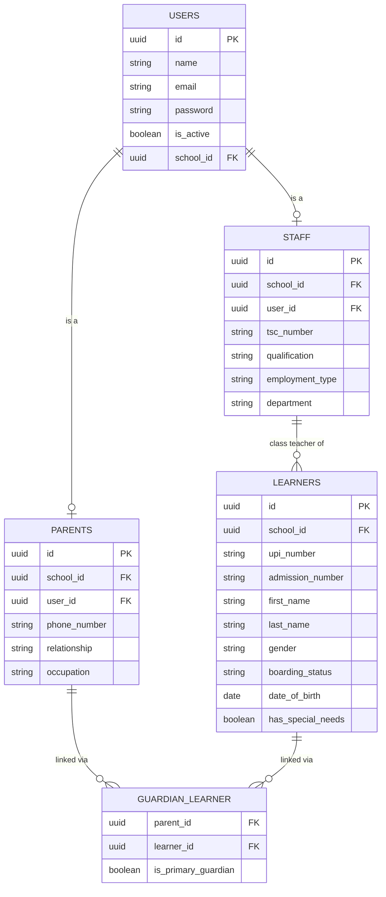

---

### 2. Academic Structure

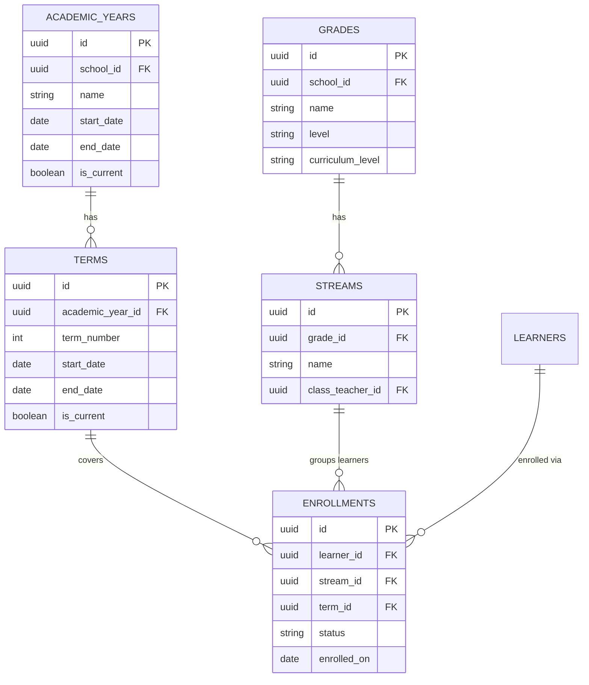

---

### 3. CBC Assessment Engine

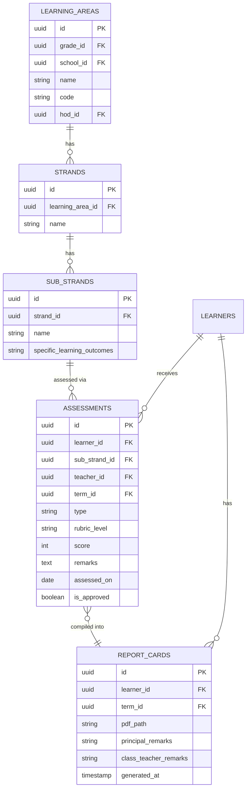

---

### 4. Fees & Financial Ledger

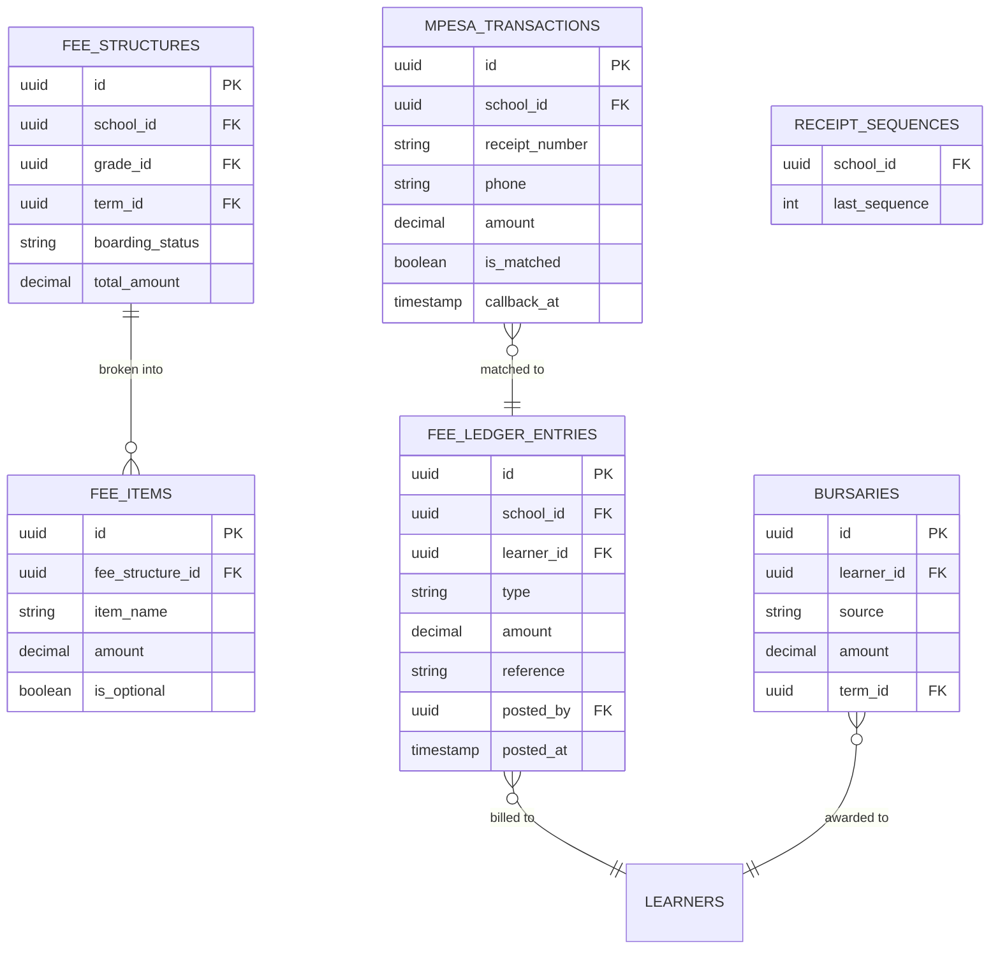

---

### 5. Timetable Engine

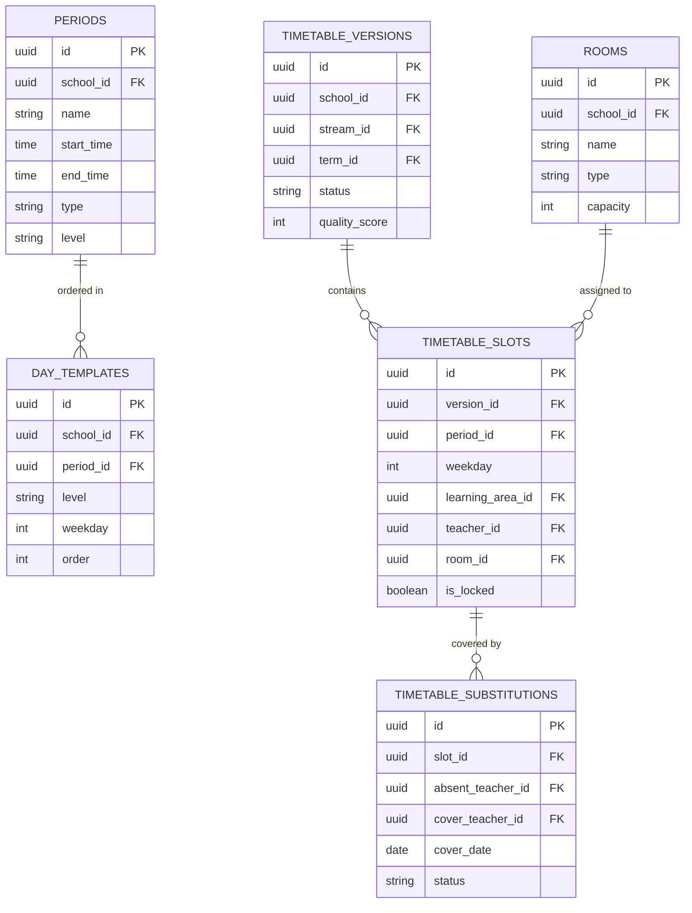

---

### 6. Attendance

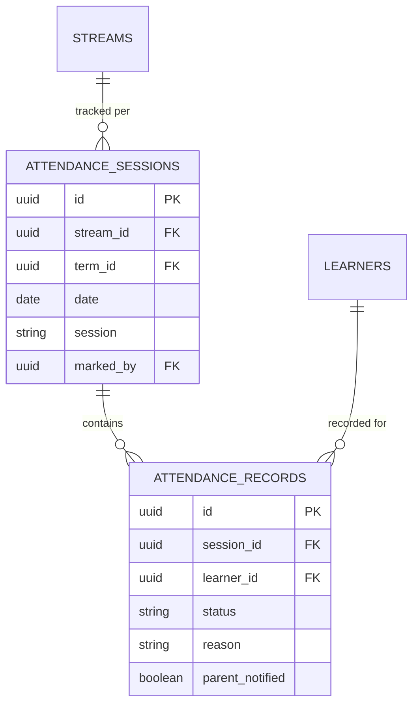

---

### 7. Transport

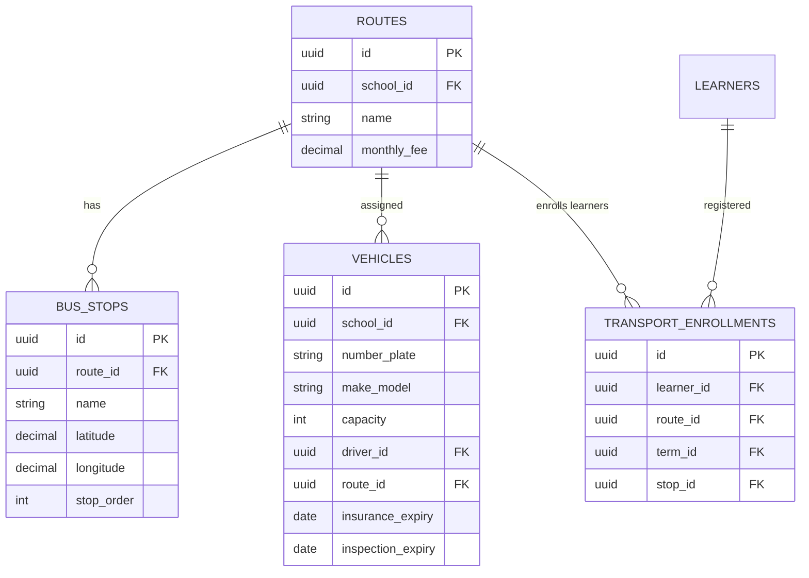

---

### 8. Library

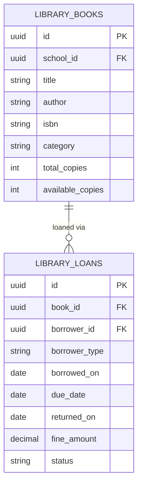

---

### 9. Hostel & Boarding

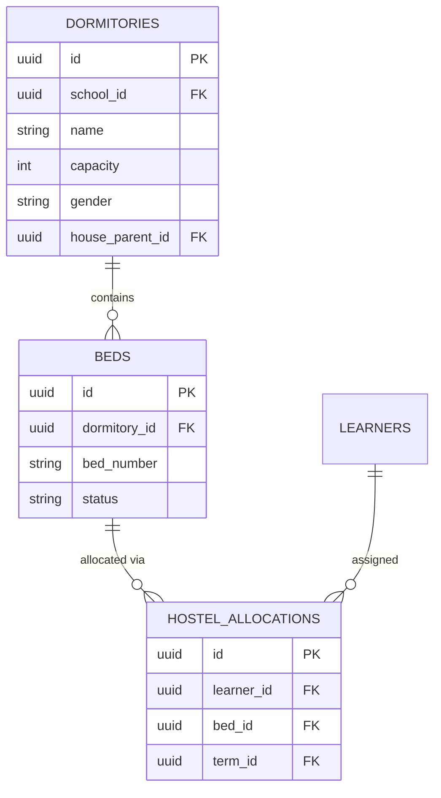

---

### 10. Discipline & Welfare

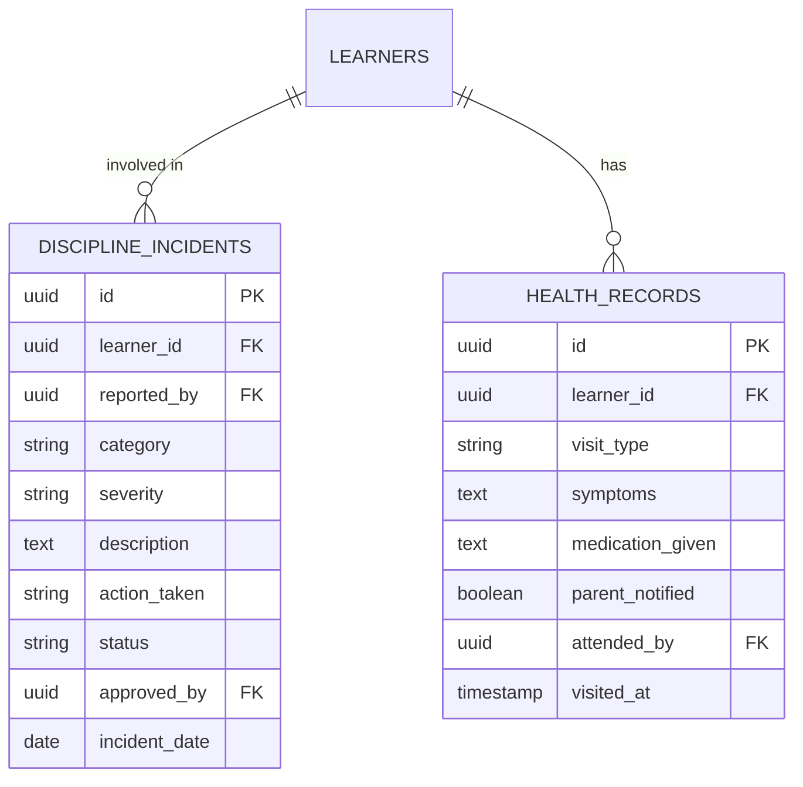

---

### 11. Staff & HR

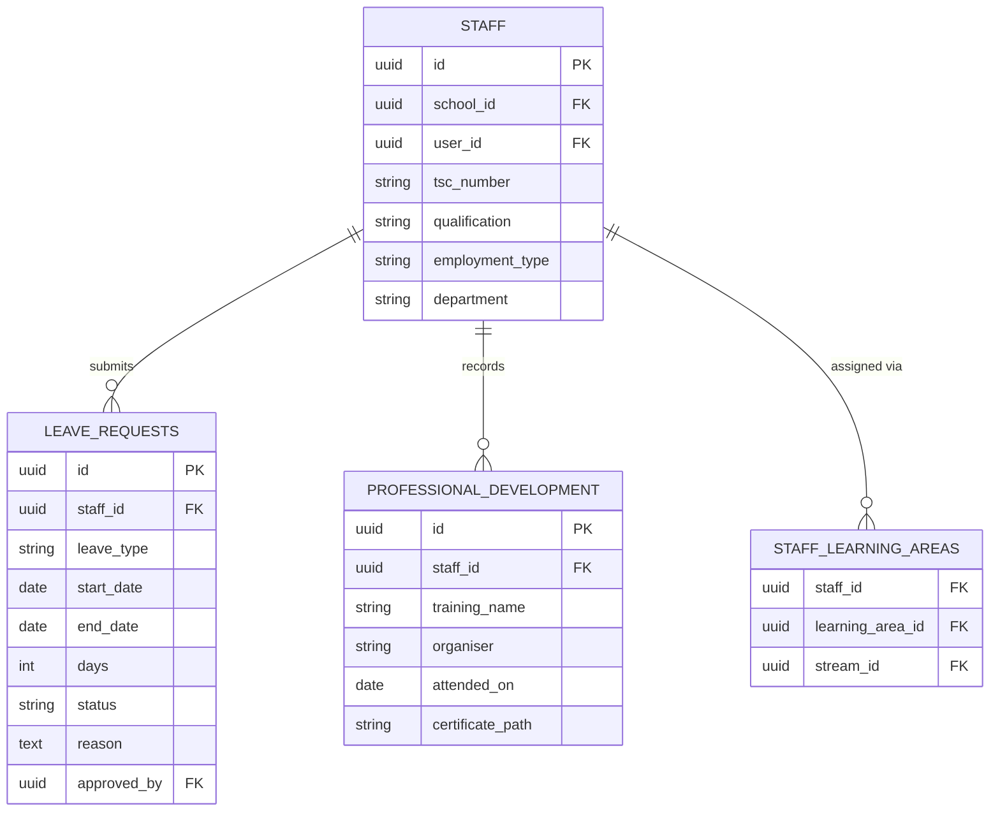

---

### 12. Compliance & Data Protection

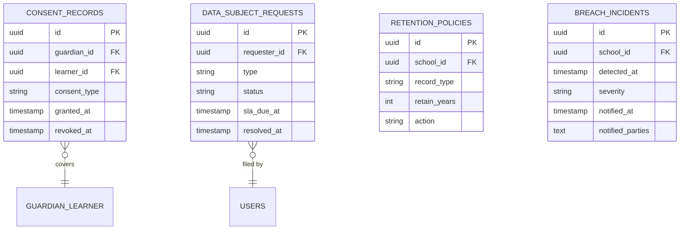

---

## 🛠️ Tech Stack

| Layer | Technology |
|---|---|
| Backend Framework | Laravel 12 |
| Reactive Frontend | Livewire 3 + Alpine.js |
| UI Framework | Tailwind CSS |
| Authentication | Laravel Breeze / Jetstream |
| Roles & Permissions | Spatie Laravel Permission |
| Multi-Tenancy | `school_id` global scopes (stancl/tenancy upgrade path) |
| Audit / Activity Log | spatie/laravel-activitylog |
| PDF Generation | DomPDF (barryvdh/laravel-dompdf) |
| QR Codes | simplesoftwareio/simple-qrcode |
| SMS Gateway | Africa's Talking PHP SDK |
| Payment Gateway | Safaricom Daraja (M-Pesa STK Push + C2B) |
| Push Notifications | Firebase Cloud Messaging (FCM) |
| Email | Laravel Mailgun / SMTP |
| AI Engine | Anthropic Claude API |
| File Storage | Laravel Storage (local / S3 roadmap) |
| Background Jobs | Laravel Horizon + Redis |
| Database | MySQL 8.0 |
| Charts | ApexCharts / Chart.js |
| Error Tracking | Sentry |
| Static Analysis | Larastan + Laravel Pint |
| Testing | PHPUnit + Pest |
| CI/CD | GitHub Actions |

---

## 🔗 API Integrations

### Safaricom Daraja (M-Pesa)
- **STK Push** — parent initiates payment prompt directly from their phone
- **C2B Paybill** — school receives payments automatically with real-time callback
- Callbacks update the fee ledger in real time
- Reconciliation matches every callback against a ledger entry
- Endpoint: `POST /api/mpesa/callback`

### Africa's Talking (SMS)
- Per-school SMS wallet with balance alerts and rate limiting
- Bulk SMS for announcements
- Transactional SMS — fee receipts, report card alerts, absenteeism, substitution cover
- Delivery reports tracked in database

### Firebase Cloud Messaging (FCM)
- Push notifications for the school mobile app and PWA
- Targeted by role, grade, or individual user

### Anthropic Claude (AI)
- Lesson plan generation, marking assistance, question generation, performance insights, report comments
- All AI calls are server-side — no API keys exposed to the client

### KEMIS
- Learner UPI registration and lookup
- KEMIS-compatible data export format
- Scheduled sync jobs via Laravel Scheduler
- Full transition from NEMIS to KEMIS (July 2025 rollout) supported

---

## ⚡ Quick Start

```bash
# 1. Clone the repository
git clone https://github.com/Dantechdevs/elimums.git
cd elimums

# 2. Install PHP dependencies
composer install

# 3. Set up environment
cp .env.example .env
php artisan key:generate

# 4. Configure your .env
# DB_DATABASE=elimums
# DB_USERNAME=root
# DB_PASSWORD=
# AT_API_KEY=your_africas_talking_key
# MPESA_CONSUMER_KEY=your_key
# MPESA_CONSUMER_SECRET=your_secret
# MPESA_SHORTCODE=174379
# MPESA_PASSKEY=your_passkey
# MPESA_ENV=sandbox
# FIREBASE_SERVER_KEY=your_firebase_key
# ANTHROPIC_API_KEY=your_claude_key
# SENTRY_LARAVEL_DSN=your_sentry_dsn

# 5. Create the database
# CREATE DATABASE elimums;

# 6. Run migrations and seed demo data
php artisan migrate --seed

# 7. Build frontend assets
npm install && npm run build

# 8. Link storage
php artisan storage:link

# 9. Start development server
php artisan serve

# 10. Start queue worker (separate terminal)
php artisan queue:work

# Optional: Laravel Horizon (production queues)
php artisan horizon
```

Visit **http://localhost:8000**

---

## 🔑 Default Login Accounts

| Role | Email | Password |
|---|---|---|
| Super Admin | admin@school.ac.ke | Admin@1234 |
| Principal | principal@school.ac.ke | Principal@1234 |
| Bursar | bursar@school.ac.ke | Bursar@1234 |
| HOD (English) | hod.english@school.ac.ke | Hod@1234 |
| HOD (Mathematics) | hod.maths@school.ac.ke | Hod@1234 |
| Class Teacher | classteacher@school.ac.ke | Teacher@1234 |
| Parent | parent@school.ac.ke | Parent@1234 |
| Learner | learner@school.ac.ke | Learner@1234 |

> ⚠️ **Change all default passwords immediately after first login in production.**

Full configuration guide — XAMPP virtual host, M-Pesa sandbox, Africa's Talking sandbox, Firebase, and Sentry setup — is in **INSTALL.md**.

---

## 📁 Module Structure

```
app/
├── Modules/
│   ├── Students/
│   ├── Assessment/
│   ├── Curriculum/
│   ├── ReportCards/
│   ├── Exams/
│   ├── Notes/
│   ├── Timetable/
│   │   ├── Models/       Period, DayTemplate, TimetableVersion, TimetableSlot, Room
│   │   ├── Services/     TimetableGenerator, ClashDetector, AllocationBalancer
│   │   ├── Jobs/         GenerateTimetable, BulkExportTimetables
│   │   ├── Livewire/     TimetableGrid, SlotEditor, GeneratorPanel, CalendarBoard
│   │   ├── Exports/      TimetablePdf, KemisTimetableExport
│   │   └── Policies/     TimetablePolicy, AnnouncementPolicy
│   ├── Attendance/
│   ├── Library/
│   ├── Transport/
│   ├── Hostel/
│   ├── Discipline/
│   ├── Fees/
│   ├── Inventory/
│   ├── Staff/
│   ├── Notifications/
│   ├── Parents/
│   ├── Analytics/
│   ├── AI/
│   ├── Compliance/
│   ├── Settings/
│   ├── Tenancy/
│   └── KEMIS/
```

---

## 🧪 Testing

```bash
# Run all tests
php artisan test

# Run specific module tests
php artisan test --filter AssessmentTest
php artisan test --filter FeesPaymentTest
php artisan test --filter LedgerReversalTest
php artisan test --filter ClashDetectorTest
php artisan test --filter TimetableGeneratorTest
php artisan test --filter SchoolScopingTest
php artisan test --filter AcademicYearRolloverTest
php artisan test --filter AttendanceTest
php artisan test --filter ComplianceTest

# Run with coverage
php artisan test --coverage
```

---

## 🗺️ Roadmap

### ✅ Completed
- Core school management (learners, staff, grades, streams)
- Full CBC assessment engine (EE/ME/AE/BE — strand & sub-strand)
- M-Pesa fee payments (Daraja STK Push + C2B Paybill)
- SMS & push notifications (Africa's Talking + Firebase FCM)
- Inventory & store management with procurement
- Learning notes & digital resource library
- PDF report cards & M-Pesa payment receipts
- KEMIS integration with pre-submission validation
- Role-based access control (13 roles — Spatie)
- Role-based login redirect
- Centralized system settings module (17 categories)
- Timetable engine — Class/Teacher/Room views, builder, auto-generator
- Kenyan school calendar with public holidays and countdown chips
- Print-ready timetable PDFs with QR codes
- Substitution and cover-sheet workflow
- Attendance management with automated parent SMS alerts
- Staff HR — leave, professional development, payroll summary
- Demo dataset (40 learners, 10 teachers, 20 parents — PP1 to Grade 9)

### 🔧 In Progress
- Deep analytics dashboard (cohort tracking, heatmaps, at-risk alerts)
- AI Lesson Assistant & AI Marking Assistant (Claude API)
- Smart homework submission & rubric grading system
- Multi-tenancy — schema now carries `school_id` on every directly-queried table (see ERDs above); still need the `BelongsToSchool` global scope, subdomain-resolution middleware, and a test asserting no model can be queried without it
- Financial ledger rewrite — append-only, reversible, M-Pesa reconciliation
- Role-scoped data access (query scopes + policies on every model)
- Global audit/activity log (spatie/laravel-activitylog)

### 📅 Planned
- AI Question Generator, AI Report Comments, AI Timetable Optimizer
- Library, Transport GPS live tracking, Hostel, Discipline & Welfare modules
- Academic year rollover wizard (reviewable, reversible, dry-run)
- Data Protection Act compliance layer (consent, retention, DSR workflow)
- Bulk onboarding import wizard with dry-run and rollback
- Per-school billing/licensing with plan gating
- Sentry, health checks, and full CI pipeline
- Tested backup/restore procedure
- Parent mobile app (Flutter — Android & iOS)
- Learner mobile app (Flutter)
- WhatsApp notifications
- Global search across learners, staff, fees, notes
- English & Kiswahili localisation with EAT timezone and +254 phone normalisation
- Document pack — admission letters, transfer certificates, learner ID cards, fee statements
- Public REST API with Laravel Sanctum (for Flutter apps)
- Offline-capable PWA mode for low-connectivity schools
- SMS/USSD fallback for parents on feature phones
- Multi-school / county dashboard for education officers
- OMR answer sheet scanning

---

## 🤝 Contributing

```bash
git checkout -b feat/your-feature
git commit -m "feat: describe your change"
git push origin feat/your-feature
# Open a Pull Request
```

| Commit Prefix | Use For |
|---|---|
| `feat:` | New feature |
| `fix:` | Bug fix |
| `chore:` | Config, dependencies, tooling |
| `docs:` | Documentation only |
| `refactor:` | Code restructure, no behaviour change |
| `test:` | Tests only |
| `migration:` | Database migration changes |

Please follow [PSR-12](https://www.php-fig.org/psr/psr-12/) coding standards and write tests for new features.

---

## 📜 License

**MIT License** — free to use, modify, and self-host. Attribution appreciated.

---

## 🙏 Acknowledgements

- [Kenya Ministry of Education](https://education.go.ke) — CBC curriculum framework
- [KEMIS](https://kemis.education.go.ke) — Kenya Education Management Information System
- [Safaricom Daraja](https://developer.safaricom.co.ke) — M-Pesa payment API
- [Africa's Talking](https://africastalking.com) — SMS gateway
- [Office of the Data Protection Commissioner, Kenya](https://www.odpc.go.ke) — Data Protection Act, 2019 guidance
- [Laravel](https://laravel.com) — The PHP framework for web artisans
- [Anthropic Claude](https://anthropic.com) — AI tools engine

---

<p align="center">
  <strong>ElimuMS — Built with ❤️ by <a href="https://ngwasidaniel.vercel.app/#contact">DanTech Developers</a></strong><br/>
  <em>"Smart Today. Success Tomorrow."</em>
</p>